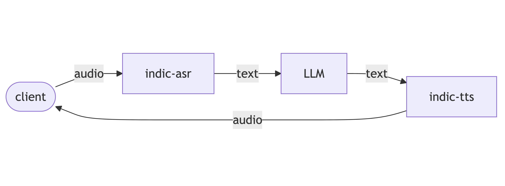

# Audio to Audio System (Kannada)
This repo is a sytem built with integration of four componnets to support KN-audio-input and return KN-audio-output.
<br>
The componnets are :
- **Client** : It is the frontend that allows user to interact with system.
- **Indic-ASR** : It is a ASR model that transcribes auido input to text in spoken language.
- **LLM** : It is Language Model to generate text output for input from ASR model.
- **Indic-TTS** : It is a TTS model which takes the LLM output as input and generates audio out of it with KN accent.

## Note
```
- Git clone : git clone https://github.com/AI4Bharat/NeMo.git
- create a utility directory in NeMo directory.
- Paste "audio_to_mono.py" from "paste_these_into_nemo_folder" in NeMo/utility directory.
- Also create a "__init__.py" file in utility folder.
```
Refer these links to better understand [indic-asr](https://ai4bharat.iitm.ac.in/areas/model/ASR/IndicConformer) and [indic-tts](https://ai4bharat.iitm.ac.in/areas/model/TTS/IndicTTS).
```
Fix Directory Path in code to have hassel free experience.
```
```
The language can be configured to any other language also. The default language in this code is Kannada.
```
## Flow


